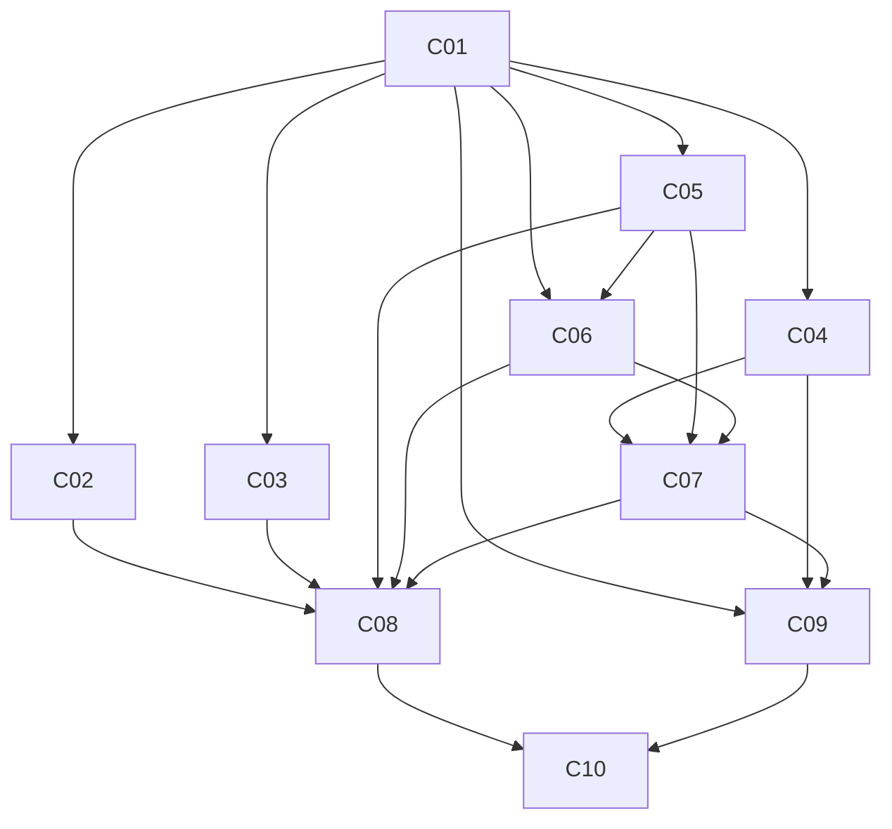

# Agent implementation status

This is the single source of truth for task progress. Task definitions and test cases remain in the linked plans; test results and implementation details belong in their session handoff records.

**Overall: 7 / 32 tasks complete (22%).** Foundation implementation is active; see dependency schedule and task rows below.

## Summary

| Workstream | Total | Pending | In progress | Blocked | Complete |
|---|---:|---:|---:|---:|---:|
| [Common foundation](#common-foundation) | 10 | 1 | 2 | 0 | 7 |
| [Fundamental agent](#fundamental-agent) | 7 | 7 | 0 | 0 | 0 |
| [Technical agent](#technical-agent) | 7 | 7 | 0 | 0 | 0 |
| [News agent](#news-agent) | 7 | 7 | 0 | 0 | 0 |
| [Cross-agent integration](#cross-agent-integration) | 1 | 1 | 0 | 0 | 0 |
| **Total** | **32** | **23** | **2** | **0** | **7** |

All tasks begin as `pending`; creating the plans does not complete implementation tasks. A task waiting for its listed prerequisites remains `pending`, rather than `blocked`.

## Status and update rules

| Status | Meaning |
|---|---|
| `pending` | Implementation has not started; prerequisites may still be outstanding. |
| `in_progress` | A session is actively implementing or validating the task. |
| `blocked` | Work has started but cannot continue; record the specific blocker and required next action. |
| `complete` | Deliverables, required tests, and the completion gate pass; a handoff and implementation commit are recorded. |

1. At session start, read this tracker, confirm dependencies, set the selected task to `in_progress`, and record an owner/session identifier.
2. When pausing or encountering a blocker, update the row with current validation results, the next action, and a link to the detailed handoff. Do not mark partially validated work complete.
3. At completion, append the [handoff record](README.md#handoff-record-template) to the relevant plan, link it from the row, and record the implementation commit. If the status update ships in that same commit, write `this commit` and resolve it through Git history rather than attempting a self-referential hash.
4. Update the summary counts, overall percentage, and next eligible task(s) whenever a status changes. After C10, the three agent tracks can progress independently.
5. Commit tracker updates with the task milestone. Keep status values here only; the plans link here rather than maintaining duplicate statuses. Required live checks that have not passed prevent task completion when its gate requires them.

Owner/session and evidence fields use `—` until work starts. In the evidence column, record test pass/fail/skip counts, the handoff link, and commit reference; for blocked tasks, include the blocker and next action.

## Common foundation

| Task | Depends on | Status | Owner / session | Validation, handoff, commit / blocker |
|---|---|---|---|---|
| [C01 — Typed contracts, fixtures, and registry](common-plan.md#c01--typed-contracts-fixtures-and-registry) | none | `complete` | contracts / 2026-09-19 | 7 tests pass; 100% statement/branch coverage; [handoff](common-plan.md#c01-handoff); this commit. |
| [C02 — Deterministic scoring and evidence coverage](common-plan.md#c02--deterministic-scoring-and-evidence-coverage) | C01 | `complete` | contracts / 2026-09-19 | 7 tests pass; 100% statement/branch coverage; [handoff](common-plan.md#c02-handoff); this commit. |
| [C03 — LangChain models, configuration, and provider boundaries](common-plan.md#c03--langchain-models-configuration-and-provider-boundaries) | C01 | `complete` | provider_prep / 2026-09-19 | 12 tests pass; Azure tool/structured/vision verified; [handoff](common-plan.md#c03-handoff); this commit. |
| [C04 — NSE ticker normalization and compatibility](common-plan.md#c04--nse-ticker-normalization-and-compatibility) | C01 | `complete` | root + contracts / 2026-09-19 | 7 ticker tests, 1 PostgreSQL test and 2 Chromium cases pass; [handoff](common-plan.md#c04-handoff); this commit. |
| [C05 — Analysis persistence and migrations](common-plan.md#c05--analysis-persistence-and-migrations) | C01 | `complete` | persistence_prep / 2026-09-19 | 7 tests pass with real PostgreSQL; [handoff](common-plan.md#c05-handoff); this commit. |
| [C06 — Evidence ledger and artifact storage](common-plan.md#c06--evidence-ledger-and-artifact-storage) | C01, C05 | `complete` | contracts / 2026-09-19 | All six required PostgreSQL cases pass; [handoff](common-plan.md#c06-handoff); this commit. |
| [C07 — Analysis API and history](common-plan.md#c07--analysis-api-and-history) | C04–C06 | `complete` | root / 2026-09-19 | 8 API tests pass on PostgreSQL; [handoff](common-plan.md#c07-handoff); this commit. |
| [C08 — Durable worker, execution limits, and recovery](common-plan.md#c08--durable-worker-execution-limits-and-recovery) | C02–C03, C05–C07 | `in_progress` | persistence_prep / 2026-09-19 | Isolated process supervisor, durable budgets, lease recovery and concurrency tests. |
| [C09 — Shared analysis UI and browser-test harness](common-plan.md#c09--shared-analysis-ui-and-browser-test-harness) | C01, C04, C07 | `in_progress` | provider_prep / 2026-09-19 | Shared analysis UI and eight fixture browser scenarios. |
| [C10 — Foundation acceptance and handoff](common-plan.md#c10--foundation-acceptance-and-handoff) | C01–C09 | `pending` | — | — |

## Fundamental agent

| Task | Depends on | Status | Owner / session | Validation, handoff, commit / blocker |
|---|---|---|---|---|
| [F01 — Select and freeze the report context](fundamental-plan.md#f01--select-and-freeze-the-report-context) | common/C10 | `pending` | — | — |
| [F02 — Reusable hybrid search and bounded evidence tools](fundamental-plan.md#f02--reusable-hybrid-search-and-bounded-evidence-tools) | F01 | `pending` | — | — |
| [F03 — Financial facts, units, and calculation helpers](fundamental-plan.md#f03--financial-facts-units-and-calculation-helpers) | F02 | `pending` | — | — |
| [F04 — Sector profiles and scoring rubrics](fundamental-plan.md#f04--sector-profiles-and-scoring-rubrics) | F03 | `pending` | — | — |
| [F05 — Iterative fundamental research agent](fundamental-plan.md#f05--iterative-fundamental-research-agent) | F01–F04 | `pending` | — | — |
| [F06 — Fundamental result view](fundamental-plan.md#f06--fundamental-result-view) | F05; common UI available | `pending` | — | — |
| [F07 — Fundamental acceptance suite and handoff](fundamental-plan.md#f07--fundamental-acceptance-suite-and-handoff) | F01–F06 | `pending` | — | — |

## Technical agent

| Task | Depends on | Status | Owner / session | Validation, handoff, commit / blocker |
|---|---|---|---|---|
| [T01 — Yahoo Finance adapter and daily data snapshot](technical-plan.md#t01--yahoo-finance-adapter-and-daily-data-snapshot) | common/C10 | `pending` | — | — |
| [T02 — Trading dates and data-quality rules](technical-plan.md#t02--trading-dates-and-data-quality-rules) | T01 | `pending` | — | — |
| [T03 — MACD and Wilder RSI calculations](technical-plan.md#t03--macd-and-wilder-rsi-calculations) | T02 | `pending` | — | — |
| [T04 — Four-panel chart image and numerical references](technical-plan.md#t04--four-panel-chart-image-and-numerical-references) | T03 | `pending` | — | — |
| [T05 — Vision-based technical assessment and scoring](technical-plan.md#t05--vision-based-technical-assessment-and-scoring) | T01–T04 | `pending` | — | — |
| [T06 — Technical result and chart view](technical-plan.md#t06--technical-result-and-chart-view) | T05; common UI available | `pending` | — | — |
| [T07 — Technical acceptance suite and handoff](technical-plan.md#t07--technical-acceptance-suite-and-handoff) | T01–T06 | `pending` | — | — |

## News agent

| Task | Depends on | Status | Owner / session | Validation, handoff, commit / blocker |
|---|---|---|---|---|
| [N01 — Tavily configuration and bounded provider adapter](news-plan.md#n01--tavily-configuration-and-bounded-provider-adapter) | common/C10 | `pending` | — | — |
| [N02 — Article identity, date filtering, and evidence storage](news-plan.md#n02--article-identity-date-filtering-and-evidence-storage) | N01 | `pending` | — | — |
| [N03 — Duplicate articles and distinct event grouping](news-plan.md#n03--duplicate-articles-and-distinct-event-grouping) | N02 | `pending` | — | — |
| [N04 — Agentic news research and event assessments](news-plan.md#n04--agentic-news-research-and-event-assessments) | N01–N03 | `pending` | — | — |
| [N05 — Event-weighted scoring, coverage, and confidence](news-plan.md#n05--event-weighted-scoring-coverage-and-confidence) | N03–N04 | `pending` | — | — |
| [N06 — News result and event evidence view](news-plan.md#n06--news-result-and-event-evidence-view) | N04–N05; common UI available | `pending` | — | — |
| [N07 — News acceptance suite and handoff](news-plan.md#n07--news-acceptance-suite-and-handoff) | N01–N06 | `pending` | — | — |

## Cross-agent integration

| Task | Depends on | Status | Owner / session | Validation, handoff, commit / blocker |
|---|---|---|---|---|
| [I01 — Cross-agent application acceptance](README.md#i01--cross-agent-application-acceptance) | C10, fundamental/F07, technical/T07, news/N07 | `pending` | — | — |

## Change history

| Change | Evidence |
|---|---|
| Initialized all 32 task statuses as pending. | Planning documents are complete; no agent implementation completion is recorded. |

## Foundation dependency schedule — 2026-09-19

C01 runs first. C02, C03, C04, and C05 then have independent implementation
scopes; concurrency is limited to available agent slots. C06 follows C05,
C07 follows C04–C06, and C08/C09 can then run concurrently. C10 integrates
all foundation work. Provider verification and PostgreSQL acceptance are
explicit gates; unavailable configuration will be recorded without marking
the affected task complete. Agent-specific business logic remains pending.
